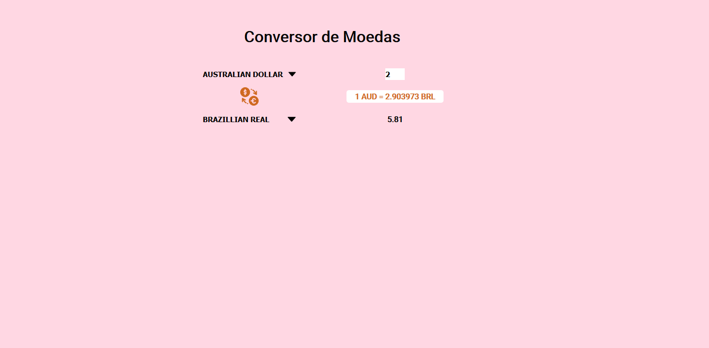

</img>

<h1>Currency Converter</h1>

# Sobre o projeto

Este é um conversor de moedas, usando as novas features do ES6+,
e ''''orientado à objetos''''.
Eu tentei usar o modelo MVC, porém, com meus conhecimentos limitados de requisições a API's,
não pude ir muito longe. Assim que eu conseguir superar essa barreira, criarei outra branch e
atualizarei o código para MVC. ( Mesmo sendo overkill, pois o projeto é minúsculo. )

# A API

É a <a href="https://www.exchangerate-api.com/">ExchangeRate-API</a>.
Entre no link para maiores informações ( API Gratúita. )
